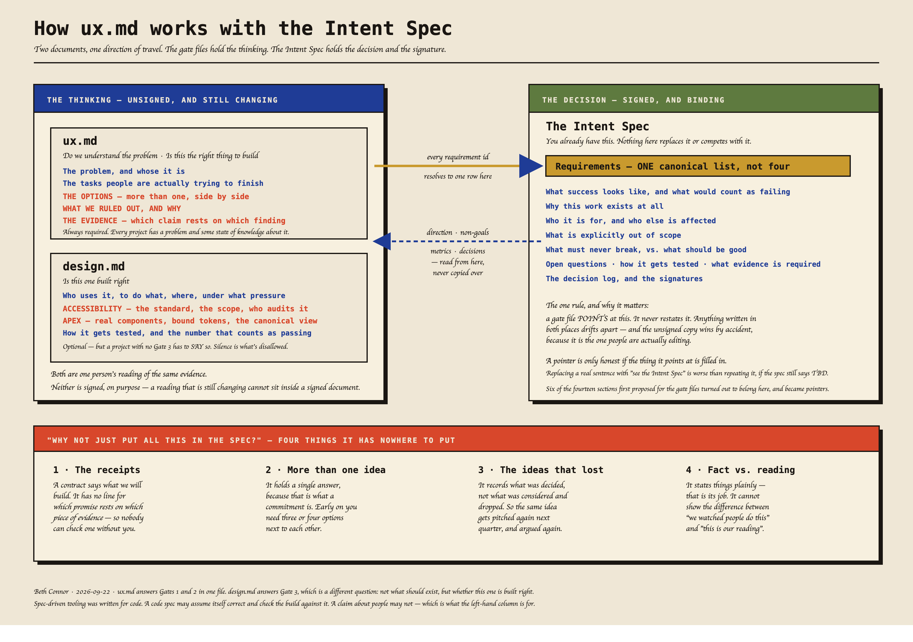

# Read this first

One page. You do not need to read anything else to start.

---

## What this is

You already have an Intent Spec: the signed document that says what gets built and what has
to be true to ship it. **Nothing here replaces it.**

This adds the part that sits *upstream* of it — what we actually know about the people we're
building for, and how strong those claims are allowed to be. Right now that lives in
Confluence and Figma, where nothing in the repo can reach it. So when someone in the repo
needs to know who the users are, they guess. Fluently.

Two markdown files in the repo, and a script that checks them.



---

## The two files

| file | the question it answers | who mostly writes it |
|---|---|---|
| `ux.md` | Do we understand the problem? And is this the right thing to build? | design, with research |
| `design.md` | Is this one built right? | engineering and design |

`ux.md` is required. `design.md` is not — but a project with no Gate 3 has to *say* that
rather than just not having one.

---

## What actually changes for you

| if you are | what changes | what doesn't |
|---|---|---|
| **Product** | The options you considered and dropped get written down once, so they stop coming back every quarter | You still own direction. Nothing here decides scope |
| **Engineering** | You can read what the UX claims rest on without asking anyone. Accessibility and design-system rules are in the repo, not in a comment thread | No new approvals. The FLOOR items were always required |
| **Design** | Your reading of the evidence has somewhere to live that isn't a deck | Nobody is grading your work. The script checks claims, not quality |
| **Research** | A claim can't quietly get stronger as it travels. Lower a finding's confidence and everything resting on it flags immediately | You still own every grade. No script sets one |

---

## The one rule worth knowing

**How strong a claim you're allowed to make depends on how the evidence was gathered — not
on how sure anyone feels.**

| what the evidence actually is | strongest claim allowed |
|---|---|
| we watched people do it | HIGH |
| we asked them, and they told us | MEDIUM |
| we worked it out ourselves | MEDIUM |
| somebody recommended it | LOW |

Then: if the people studied weren't the actual users, everything drops to LOW.

**Ten consistent interviews still cap at MEDIUM.** More of the same kind of evidence widens
*who* a claim covers. It doesn't make anyone more certain. That's the whole mechanism.

---

## Your first twenty minutes

```bash
cd examples/alert-digest && ../../check-gates.sh
```

That's a small fictional project that ships with this. It **fails on purpose**:

```
FAIL E-02 — asserts HIGH. overnight-alerts-arrive-in-bulk is STATED_ATTITUDE / primary
     fidelity, which ceilings at MEDIUM.
```

A document claimed HIGH; the evidence underneath it caps at MEDIUM; the check named which
line. Nobody typed that ceiling — it was computed from two fields on the finding.

**If that run comes back clean, something is wrong with your setup.** The failure is the test.

---

## Three things this does not do

- **It does not block you.** A red check is the normal state of honest early work. The gate
  asks *"is this honest about being unfinished?"*, not *"is this finished?"* An unticked box
  is not a failure and hasn't been since 21 September.
- **It adds one recurring obligation, and I'm not going to pretend otherwise.** Everything
  here is a file and a script *except one thing*: a script can check that a box is ticked, but
  it cannot check that the claim written next to it is true. Only a person reading the source
  can. So somebody has to audit **one claim, picked at random, against its actual source** on
  a regular basis — about fifteen minutes. Skip that and this whole apparatus is theatre, and
  `RITUALS.md` says so in those words.

  `RITUALS.md` proposes doing it in a fortnightly 30-minute review. **If your team doesn't do
  standing meetings, do it async** — one named person per sprint audits one criterion and
  writes two lines in `OPEN.md`. The audit is the requirement; the meeting is one way to get
  it. Neither version has been run yet, so treat both as a proposal.
- **It does not replace the Intent Spec, Spec Kit, or your workflow.** It bolts on. And
  honestly: in your real repository it is **not wired in yet.** That connection is the thing
  we want you to test.

---

## The three scripts, and what their exit codes mean

This is the whole contract. Your CI decides which of these fail a build; the scripts only
report what kind of problem it is.

| script | asks | exit |
|---|---|---|
| `./check-gates.sh` | is any claim stronger than its evidence allows? | `0` clean · `1` a real fault |
| `./check-claims.sh` | is every claim well-formed and attributed? | `0` clean · `1` a malformed or unattributed claim |
| `./check-blocked.sh` | is a person holding this up? | `0` clean · `2` someone owes a decision · `3` the register is unreadable |

**Exit 1 on a fresh clone is correct.** Nothing has been decided yet and the scripts say so
rather than passing quietly.

## Setting it up

```bash
/ux-kickoff
```

Three questions: where your existing spec lives, who sets a confidence grade, and whether
the claims in `ux.md` are evidenced or were written to get started. "We made it up" and
"nobody yet" are both complete answers — it writes down what you say and doesn't guess.

Or edit `project.conf` by hand. It's the only file you have to change.

---

*This is the skinny v1 — three scripts and two gate files, generated from a larger toolkit
that has fifteen scripts, nine registers and a nine-question kickoff. Everything left out
was left out on purpose, and none of it is needed to try the idea. If you hit something
this version can't answer, that's useful: say so rather than working around it.*
